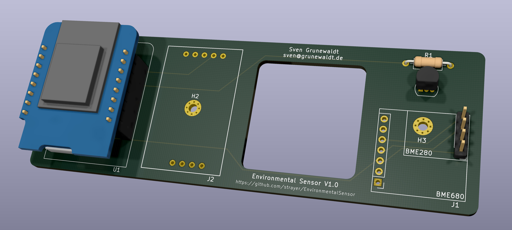

# Environmental Sensor

A WiFi environmental sensor based on Tasmota that reports temperature, air pressure, air quality, humidity and CO2 (ppm).

## Description

It features the following sensors:

- BME 280 / BME 680 - air pressure, air quality (BME 680) and humidity
- MH-Z19B - CO2 (ppm)
- DS18B20 - temperature

The DS18B20 is featured on the PCB because the temperature sensor of the BME 280 / BME 680 is very sensitive - simply holding your finger above it may cause incorrect readings. The DS18B20 is reasonably accurate, cheap and known in the DIY community, so it was a simple addition to get reliable temperature readings.

Either a BME 280 or a BME 680 is supported by the PCB. This was only added because I had a BME 680 lying around, so why not use it - the BME 280 is cheaper and due to the MH-Z19B the air quality reading is pretty obsolete, so in general I recommend installing a BME 280.

The PCB has an internal cutout to avoid transferring heat from the D1 Mini to the temperature-reading components on the other side.

The software intended to be run on the device is [Tasmota](https://github.com/arendst/Tasmota). A preconfigured template will be added later.

## Parts list

- [D1 Mini](https://www.reichelt.de/d1-mini-esp8266-v3-0-d1-mini-p253978.html?search=wemos+d1+mini)
- [BME 280 breakout board](https://amzn.to/2UZ1Zrr)
- [DS18B20](https://www.reichelt.de/digital-thermometer-1-wire--0-5-c-to-92-ds-18b20-p58169.html?&nbc=1)
- [MH-Z19B](https://www.reichelt.de/infrarot-co2-sensor-mh-z19b-co2-mh-z19b-p266033.html)

## Attributions

[MH-Z19B footprint](https://github.com/klein0r/pcb-footprint-collection-kicad/blob/master/MH-Z19B.kicad_mod) (MIT) by [Matthias Kleine (klein0r)](https://github.com/klein0r)
